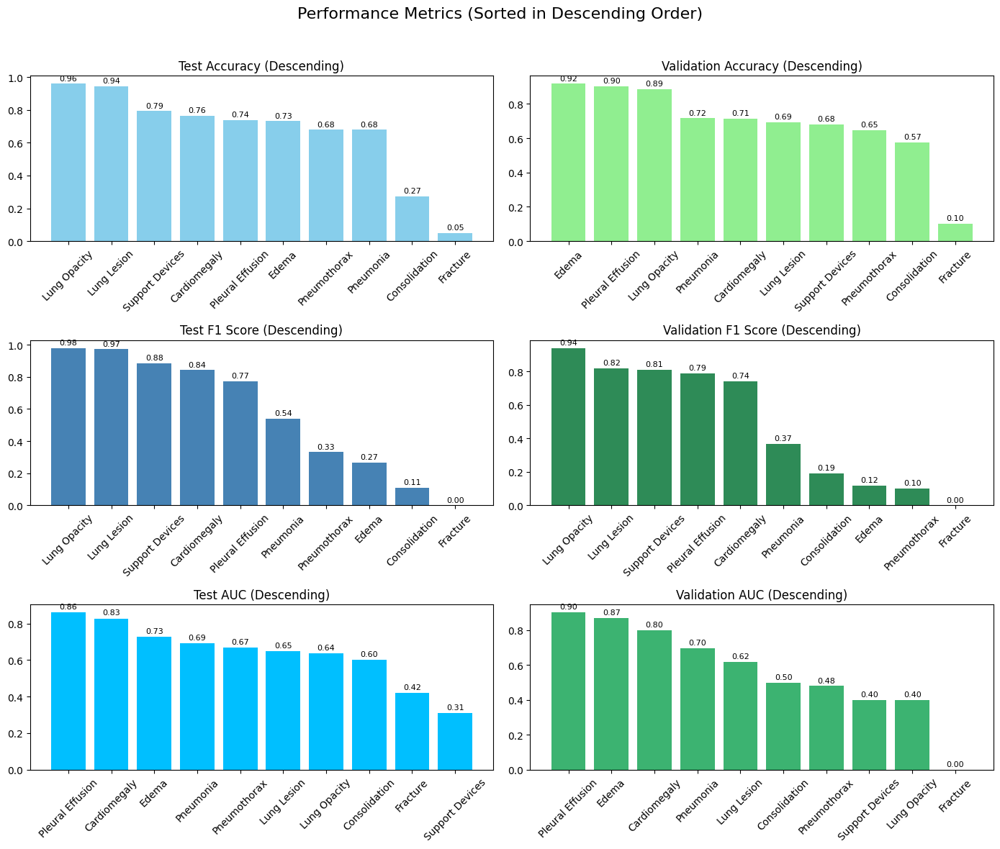

# MIMIC-CXR: Chest X-ray Image Classification and Report Generation
## Alexander Koehler, Feng-Jen Hsieh, Yuandi Tang

## Overview

This repository contains the implementation and results of the research paper **"MIMIC-CXR: Chest X-ray Image Classification and Report Generation"**. The project leverages the MIMIC-CXR dataset, which includes chest X-ray images along with corresponding radiology reports. The goal is to develop an automated system capable of both **classifying chest abnormalities** and **generating radiologist-style reports**. We utilize advanced convolutional neural networks (CNNs) for image classification, alongside cutting-edge multimodal models, such as **LLaMA-3.2-11B-Vision-Instruct**, for text generation.

**See our paper [here](https://www.overleaf.com/read/ndtcsshrwzzd#1ced8a)**

**See our demo [here](https://www.canva.com/design/DAGXdXy0xKU/BVLZYe-p23RkPfG2Qx_YaQ/view?utm_content=DAGXdXy0xKU&utm_campaign=designshare&utm_medium=link&utm_source=editor)**

## Main Objectives

1. **Classify Chest X-ray Abnormalities**: Train CNN models to detect common chest conditions such as pneumonia, pleural effusion, and pneumothorax.

2. **Generate Diagnostic Reports**: Utilize advanced language models to create concise and accurate diagnostic reports based on chest X-ray images.

3. **Multimodal Image-Text Alignment**: Employ multimodal models, specifically LLaMA-3.2-11B-Vision-Instruct, to improve the alignment between visual features and textual descriptions.

4. **Enhance Healthcare Efficiency**: Improve diagnostic workflows and automate the process of chest X-ray interpretation.

## Approach

The project utilizes a combination of advanced CNN architectures and multimodal models to enhance chest X-ray analysis and reporting:

### 1. CNN Architectures for Image Classification

- Evaluated several pretrained CNN models, including VGG-16, ResNet, and DenseNet.
- ResNet-18 demonstrated the best performance and was chosen for further tuning.
- ResNet50 emerged as the most accurate model for complex pathologies.

### 2. LLaMA-3.2-11B-Vision-Instruct for Text Generation and Multimodal Alignment

- Used for generating concise, clinically relevant radiology reports from the images.
- Integrates vision and language to interpret medical images and generate coherent diagnostic reports.
- Fine-tuned to align text and visual features effectively.

### 3. Preprocessing and Data Augmentation

- Preprocessing pipeline includes merging metadata, aligning images, filtering for PA chest X-rays, and resizing images.
- Data augmentation techniques such as random horizontal flips and rotations are applied during training.

### 4. Training and Evaluation

- Dataset split into training and validation sets.
- Early stopping implemented to mitigate overfitting.
- Performance assessed using metrics like F1-score, ROC-AUC, and accuracy.

### 5. Multimodal Integration

- LLaMA's vision encoder processes X-ray images, while the text generator creates coherent diagnostic narratives.
- This integration aims to bridge the gap between image and textual data for accurate report generation.

By combining these advanced CNN architectures with the multimodal capabilities of LLaMA-3.2-11B-Vision-Instruct, the project aims to create a comprehensive system that can both accurately classify chest abnormalities and generate detailed, radiologist-style reports. This approach has the potential to significantly enhance the efficiency and accuracy of chest X-ray interpretation in clinical settings.

## Table of Contents

1. [Introduction](#introduction)
2. [Dataset](#dataset)
3. [Methodology](#methodology)
   - [Preprocessing](#preprocessing)
   - [Model Architecture](#model-architecture)
   - [Training and Evaluation](#training-and-evaluation)
4. [Results](#results)
5. [Discussion](#discussion)
6. [Conclusion](#conclusion)
7. [References](#references)

## File Directory

1. [Prepocessing Methods](Prepocessing.ipynb)
2. [CNN Model Tuning](/CNN/CNN_tuning.ipynb)
3. [CNN Model Training Testing and Validation](/CNN/CNN_train_test.ipynb)
4. [CNN Model Evaluation](/CNN/CNN.png)
5. [LLama Setting Up](/Text_Generation/Llama_Setting_Up.ipynb)
6. [LLama Training](/Text_Generation/Loading_and_Training.ipynb)
7. [LLama Results Analysis](/Text_Generation/Results_analysis.ipynb)
9. [Final Report](Project_Report.pdf)

## Introduction

Chest X-rays are pivotal for diagnosing various thoracic conditions. Yet, their interpretation is prone to error, especially for subtle or rare abnormalities. The **MIMIC-CXR dataset** offers a substantial resource for developing AI systems to assist radiologists by reducing their workload and improving diagnostic accuracy.

This project employs CNNs and the advanced multimodal model **LLaMA-3.2-11B-Vision-Instruct** to process chest X-ray images and generate diagnostic reports. By combining image classification with NLP-driven insights, our system aims to enhance clinical workflows and offer a scalable solution for medical imaging challenges.

## Dataset

We utilized the MIMIC-CXR dataset, focusing on a curated subset of chest X-ray images. The dataset includes:

- Chest X-ray images in DICOM format
- Radiology reports associated with each image
- Disease labels: Binary disease annotations
- View positions: PA (posterior-anterior), AP (anterior-posterior), LATERAL

## Methodology

Our methodology comprises several key steps, including data preprocessing, model architecture selection and tuning, multimodal integration, and evaluation.

### 4.1 Dataset Description and Preprocessing

We utilized the MIMIC-CXR dataset, focusing on a curated subset of chest X-ray images. The preprocessing pipeline involved:

1. Merging metadata from multiple CSV files, including patient records, CheXpert labels, and metadata.
2. Aligning images based on subject_id, study_id, and dicom_id.
3. Filtering the dataset to include only posterior-anterior (PA) chest X-rays with labels as 1 (case) or 0 (control), resulting in 4742 images.
4. Selecting a single PA image per subject to maintain balance.
5. Resizing images to 224×224 pixels and normalizing using a mean and standard deviation of 0.5.

### 4.2 Model Architecture and Tuning

We evaluated several pretrained CNN models, including VGG-16, ResNet, and DenseNet. These models were fine-tuned by modifying the final fully connected layer to produce a single output node for binary classification. The Adam optimizer was used during training, with adjustable learning rates and weight decay for improved regularization.

Among the tested models, ResNet-18 demonstrated the best performance and was chosen for further tuning. Hyperparameters such as learning rate, weight decay, batch size, and dropout probability were evaluated using the validation set to select the best-performing model settings.

### 4.3 Multimodal Integration with LLaMA

LLaMA-3.2-11B-Vision-Instruct was fine-tuned to align text and visual features. The model's vision encoder processed X-ray images, while the text generator created coherent diagnostic narratives.

### 4.4 CNN Training and Evaluation

The dataset was split into training and validation sets. We implemented early stopping during training to mitigate overfitting. The training process included:

1. Implementing a training loop with early stopping.
2. Applying data augmentation techniques, including random horizontal flips and rotations, during training.
3. Assessing model performance using metrics such as F1-score, ROC-AUC, and accuracy on the validation set.

All computations were carried out using PyTorch, with GPU acceleration to streamline the training process.

### 4.5 Training Process for LLaMA-3.2-11B-Vision-Instruct

The training process for LLaMA-3.2-11B-Vision-Instruct involved several key strategies:

- **Dataset Preparation**: 2562 samples for training and 285 for validation.
- **Instruction-based Learning**: Using an expert radiographer instruction to guide the model.
- **Conversation Format**: Converting training data into a conversation format.
- **Model Configuration**: Using 4-bit quantization and gradient checkpointing.
- **Training Techniques**: Implementing early stopping and data augmentation.
- **Hyperparameters**: 
  - Number of training epochs: 2
  - Batch size: 8 per device
  - Gradient accumulation steps: 4
  - Learning rate: 1e-4
  - Warmup steps: 5
  - Maximum steps: 200
- **Hardware Optimization**: Utilizing NVIDIA A100-SXM4-80GB GPUs with mixed precision training.
- **Custom Data Collator**: Using a specialized UnslothVisionDataCollator for handling multimodal data.

This comprehensive methodology ensured that both the CNN models and LLaMA-3.2-11B-Vision-Instruct were optimally prepared for the challenging task of chest X-ray interpretation and report generation.

### Model Architecture

We evaluated several pretrained CNN models, including VGG-16, ResNet, and DenseNet. Among the tested models, ResNet-18 demonstrated the best performance and was chosen for further tuning. 

For text generation and multimodal alignment, we employed **LLaMA-3.2-11B-Vision-Instruct**.

### Training and Evaluation

The dataset was split into training and validation sets. We implemented early stopping during training to mitigate overfitting. Data augmentation techniques, including random horizontal flips and rotations, were applied during training.

Model performance was assessed using metrics such as F1-score, ROC-AUC, and accuracy, calculated on the validation set.

## Results

Our model demonstrated varying performance across different chest abnormalities:

| Disease          | Accuracy | F1 Score | AUC    |
|------------------|----------|----------|--------|
| Pneumonia        | 0.6792   | 0.5405   | 0.6914 |
| Pleural Effusion | 0.7385   | 0.7733   | 0.8618 |
| Pneumothorax     | 0.6800   | 0.3333   | 0.6667 |
| Atelectasis      | 0.7647   | 0.8421   | 0.8279 |
| Cardiomegaly     | 0.2727   | 0.1111   | 0.6000 |
| Consolidation    | 0.7317   | 0.2667   | 0.7270 |

The results show that our model performs well in detecting common abnormalities like pleural effusion and atelectasis, with high accuracy and F1 scores. However, performance on rarer conditions like cardiomegaly was less robust.

## Discussion

### Strengths
1. **LLaMA's Integration for Enhanced Reporting**: The use of LLaMA-3.2-11B-Vision-Instruct significantly enhanced the quality and coherence of diagnostic report generation.
2. **ResNet18's Superior Performance**: Among the evaluated architectures, ResNet18 emerged as the most accurate model for complex pathologies.

### Challenges
1. **Difficulty in Handling Rare Abnormalities**: Cardiomegaly and similar underrepresented conditions pose a challenge due to dataset imbalance.
2. **Dataset Bias and Generalization Issues**: Heavy reliance on the MIMIC-CXR dataset introduces biases specific to its demographic and clinical environment.

## Conclusion

While our model shows promise in automating chest X-ray analysis, there is still significant room for improvement, particularly in handling rarer conditions and generating comprehensive reports. The combination of CNN-based classification and advanced language models like LLaMA-3.2-11B-Vision-Instruct represents a promising direction for future research in medical imaging AI.

Future work should focus on:
1. Improving the model's performance on rarer conditions
2. Exploring more sophisticated data augmentation techniques
3. Investigating the potential of ensemble methods to boost overall performance
4. Further integration of LLaMA-3.2-11B-Vision-Instruct for comprehensive report generation

## References

1. Rajpurkar, P., et al. (2017). CheXNet: Radiologist-level pneumonia detection on chest X-rays with deep learning.
2. Li, C., et al. (2023). Llava-Med: Training a large language-and-vision assistant for Biomedicine in one day.
3. Moon, J. H., et al. (2022). Multi-modal understanding and generation for medical images and text via vision-language pre-training.
4. Park, K., et al. (2022). Covid-19 CXR classification: Applying domain extension transfer learning and deep learning.
5. Johnson, A., et al. (2024). MIMIC-CXR Database v2.1.0.
6. Johnson, A. E. W., et al. (2019). MIMIC-CXR, a de-identified publicly available database of chest radiographs with free-text reports.
7. Goldberger, A. L., et al. (2000). PhysioBank, PhysioToolkit, and PhysioNet: Components of a new research resource for complex physiologic signals.
